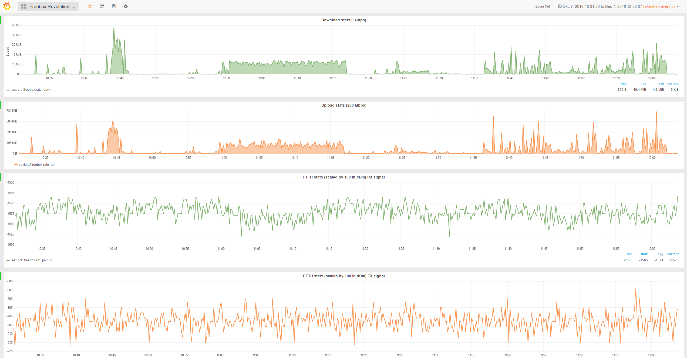
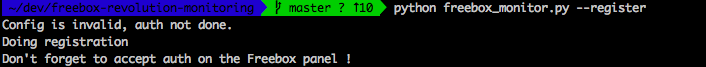
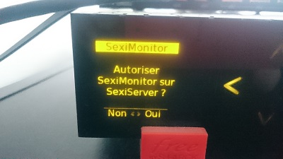
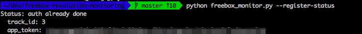
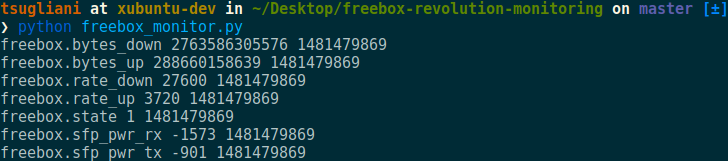
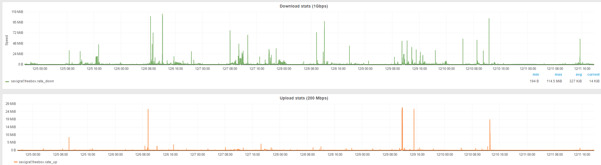
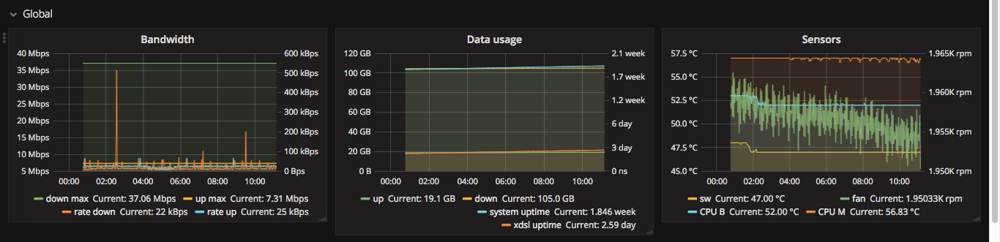
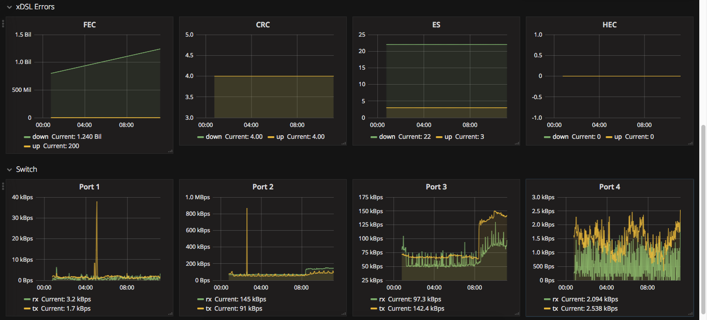

# freebox-revolution-monitoring
Simple Freebox Revolution Monitoring with SexiGraf 



Based/Inspired by https://github.com/tuxtof/freebox-monitoring

The newer freebox devices don't offer the hosted file with all the data information usually accessible here [`http://mafreebox.freebox.fr/pub/fbx_info.txt`](http://mafreebox.freebox.fr/pub/fbx_info.txt)

So this solution is leveraging the [Freebox API](http://dev.freebox.fr/sdk/os/) but just focuses on the stats I'm interested in, if you want to extend the script check all the other things available [here](http://dev.freebox.fr/sdk/os/connection/)

# Pre-requisites

This is what I used, you can of course adapt the collector script to talk to influxdb or whatever :-)

- [SexiGraf](http://www.sexigraf.fr) or any Grafana/Graphite stack
- [Telegraf](https://github.com/influxdata/telegraf)
- Python with `json` & `requests` libraries installed
- Physical Access to the Freebox Server device

# Step 1: Register an app with the Freebox device

First thing to do is to register an app, to generate a specific `freebox_app_token`.

Run `python freebox_monitoring.py --register [-e endpoint] [-a "My app_name" -i "My app_id" -d "My device_name"]` to do that.

*PS: You can modify the app name/id/device name with -a My_app_name -i My_app_id -d My_device_name (Optional)*
*PS: You can specify the -e endpoint (Freebox name or address) to allow multiple endpoints (Optional)*

Once you execute this script, you will see something similar to this:



Head to your Freebox Server device.



Press the `>` to authorize the app registration process.

You can check the saved tokens with `python freebox_monitor.py --register-status`:



If you need to re-auth you can delete the authorization credentials by removing the file `.credentials` in the directory where `freebox_monitor.py` is.

# Step 2: Use the script to display freebox statistics information

Once you have your `freebox_app_token`, the process to authenticate happens in 2 steps:
- Fetch the current `challenge`. (basically a random generated string changing over time)
- Compute a `session password` with the `challenge` and your `freebox_app_token`.

(This avoids sending the token over the network)

Then execute it, to make sure it connects and displays information.



# Step 3: Stats to get and show

By default it auto adapts beetween FFTH and xDSL, by using a switch indicated (`python freebox_monitor.py 'indicated switch'`) you can get the listed stats.

  * FFTH and xDSL (no switch, default)
    * bytes up/down
    * rate up/down
    * bandwidth up/down
    * connection state
    
  * FTTH
    * sfp power rx/tx
  
  * xDSL (each for up, and down, except uptime)
    * uptime
    * errors: es, hec, crc, ses, fec
    * rate, attenuation, signal noise ratio, max rate
    * G.INP status, corrected and uncorrected
    
  * System infos (-H switch)
    * Fan RPM, temp SW, CPU B, CPU M, Box uptime
    
  * Switch status (-S switch)
    * for each switch port: link mode
    
  * Switch ports status (-P switch)
    * for each switch port: rx/tx bytes rate

# Step 4: Leverage telegraf to call the script and send stats to Graphite

Install telegraf on the SexiGraf appliance.

```console
wget https://dl.influxdata.com/telegraf/releases/telegraf_1.0.1_amd64.deb
dpkg -i telegraf_1.0.1_amd64.deb 
```

Generate a config file for our plugins `exec` and `graphite`.

```console
telegraf --input-filter exec --output-filter graphite config > /etc/telegraf/telegraf.conf
```

Check & edit the configuration file to make it look as follows:

```ini
###############################################################################
#                            OUTPUT PLUGINS                                   #
###############################################################################

# Configuration for Graphite server to send metrics to
[[outputs.graphite]]
  ## TCP endpoint for your graphite instance.
  ## If multiple endpoints are configured, output will be load balanced.
  ## Only one of the endpoints will be written to with each iteration.
  servers = ["localhost:2003"]
  ## Prefix metrics name
  prefix = ""
  ## Graphite output template
  ## see https://github.com/influxdata/telegraf/blob/master/docs/DATA_FORMATS_OUTPUT.md
  template = "host.tags.measurement.field"
  ## timeout in seconds for the write connection to graphite
  timeout = 2

###############################################################################
#                            INPUT PLUGINS                                    #
###############################################################################

# Read metrics from one or more commands that can output to stdout
[[inputs.exec]]
  ## Commands array
  command = [
     "/usr/local/freebox-revolution-monitoring/freebox_monitor.py",
     "/usr/local/freebox-revolution-monitoring/freebox_monitor.py -e another_freebox_address"
  ]

  ## Timeout for each command to complete.
  timeout = "5s"

  ## Data format to consume.
  ## Each data format has it's own unique set of configuration options, read
  ## more about them here:
  ## https://github.com/influxdata/telegraf/blob/master/docs/DATA_FORMATS_INPUT.md
  data_format = "graphite"
```

Copy your modified `freebox_monitor.py` script to `/usr/local/freebox-revolution-monitoring/`

Relaunch telegraf and check the logs

```console
root@sexigraf:~# tail -f /var/log/telegraf/telegraf.log
2016/12/11 18:26:30 Output [graphite] buffer fullness: 7 / 10000 metrics. Total gathered metrics: 675367. Total dropped metrics: 0.
2016/12/11 18:26:30 Output [graphite] wrote batch of 7 metrics in 165.892µs
2016/12/11 18:26:40 Output [graphite] buffer fullness: 7 / 10000 metrics. Total gathered metrics: 675374. Total dropped metrics: 0.
2016/12/11 18:26:40 Output [graphite] wrote batch of 7 metrics in 169.849µs
2016/12/11 18:26:50 Output [graphite] buffer fullness: 7 / 10000 metrics. Total gathered metrics: 675381. Total dropped metrics: 0.
2016/12/11 18:26:50 Output [graphite] wrote batch of 7 metrics in 183.453µs
2016/12/11 18:27:00 Output [graphite] buffer fullness: 7 / 10000 metrics. Total gathered metrics: 675388. Total dropped metrics: 0.
2016/12/11 18:27:00 Output [graphite] wrote batch of 7 metrics in 156.956µs
2016/12/11 18:27:10 Output [graphite] buffer fullness: 7 / 10000 metrics. Total gathered metrics: 675395. Total dropped metrics: 0.
2016/12/11 18:27:10 Output [graphite] wrote batch of 7 metrics in 170.216µs
2016/12/11 18:27:20 Output [graphite] buffer fullness: 7 / 10000 metrics. Total gathered metrics: 675402. Total dropped metrics: 0.
2016/12/11 18:27:20 Output [graphite] wrote batch of 7 metrics in 177.338µs
```

If the output is similar to this, you should be good to go and build your own dashboards in SexiGraf.

Here is a 2 day view of the download/upload stats.



Example of the xDSL graphs




Enjoy !
